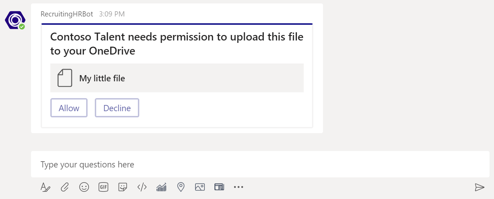

# <a name="send-and-receive-files-through-your-bot"></a>通过你的 bot 发送和接收文件

[!include[v3-to-v4-SDK-pointer](~/includes/v3-to-v4-pointer-bots.md)]

有两种方法可以在 bot 之间发送文件：

* 使用 Microsoft Graph Api。 此方法适用于团队中所有范围内的 bot：
  * `personal`
  * `channel`
  * `groupchat`
* 使用团队 Api。 这些仅支持一个上下文中的文件：
  * `personal`

## <a name="using-the-microsoft-graph-apis"></a>使用 Microsoft Graph Api

您可以使用适用于 [OneDrive 和 SharePoint](/onedrive/developer/rest-api/)的 Microsoft Graph api，使用包含卡片附件的邮件发布引用现有 SharePoint 文件的邮件。 使用 Graph Api 需要获取对用户的 OneDrive 文件夹 (和文件的访问 `personal` 权限 `groupchat`) 或团队通道中的文件 (`channel` 通过标准 OAuth 2.0 授权流) 的文件。 此方法适用于所有团队作用域。

## <a name="using-the-teams-bot-apis"></a>使用团队 Bot Api

> [!NOTE]
> 此方法仅在上下文中有效 `personal` 。 它在或上下文中不起作用 `channel` `groupchat` 。

你的 bot 可以使用团队 Api 直接在上下文中的用户发送和接收文件 `personal` （也称为个人聊天）。 这样，您就可以实现费用报告、图像识别、文件存档、电子签名和其他涉及直接操作文件内容的方案。 在团队中共享的文件通常显示为卡片，并允许进行丰富的应用程序内查看。

以下各节介绍如何执行此操作以通过直接用户交互（如发送邮件）发送文件内容。 此 API 作为 Microsoft 团队 Bot 平台的一部分提供。

### <a name="configure-your-bot-to-support-files"></a>将你的 bot 配置为支持文件

为了在你的 bot 中发送和接收文件，您必须将 `supportsFiles` 清单中的属性设置为 `true` 。 此属性在清单参考的 " [bot](~/resources/schema/manifest-schema.md#bots) " 部分中进行描述。

定义将如下所示： `"supportsFiles": true` 。 如果你的 bot 未启用 `supportsFiles` ，以下功能将不起作用。

### <a name="receiving-files-in-personal-chat"></a>在个人聊天中接收文件

当用户向你的 bot 发送文件时，首先将该文件上传到用户的 OneDrive for Business 存储。 然后，你的 bot 将收到一条消息活动，通知用户上传。 该活动将包含文件元数据，例如其名称和内容 URL。 您可以直接从该 URL 读取以提取其二进制内容。

#### <a name="message-activity-with-file-attachment-example"></a>带有文件附件的邮件活动示例

```json
{
  "attachments": [{
    "contentType": "application/vnd.microsoft.teams.file.download.info",
    "contentUrl": "https://contoso.sharepoint.com/personal/johnadams_contoso_com/Documents/Applications/file_example.txt",
    "name": "file_example.txt",
    "content": {
      "downloadUrl" : "https://download.link",
      "uniqueId": "1150D938-8870-4044-9F2C-5BBDEBA70C9D",
      "fileType": "txt",
      "etag": "123"
    }
  }]
}
```

下表描述了附件的内容属性：

| 属性 | 用途 |
| --- | --- |
| `downloadUrl` | OneDrive URL，用于提取文件内容。 您可以 `HTTP GET` 直接从此 URL 发出。 |
| `uniqueId` | 唯一的文件 ID。 如果用户将文件发送到你的 bot，这将是 OneDrive 驱动器项目 ID。 |
| `fileType` | 文件扩展名类型，如 pdf 或 .docx。 |

作为一种最佳做法，您应通过向用户发送回邮件来确认文件上载。

### <a name="uploading-files-to-personal-chat"></a>将文件上传到个人聊天

将文件上传到用户涉及以下步骤：

1. 向用户发送一封邮件，请求写入该文件的权限。 此邮件必须包含 `FileConsentCard` 要上载的文件的名称附件。
2. 如果用户接受文件下载，则你的 bot 将收到具有位置 URL 的 *调用* 活动。
3. 若要转移文件，你的 bot 将 `HTTP POST` 直接执行提供的位置 URL 中的。
4. （可选）如果您不希望允许用户接受对同一文件的更多上载，则可以删除原始同意卡。

#### <a name="message-requesting-permission-to-upload"></a>邮件请求上载的权限

此桌面邮件包含一个简单的附件对象，该对象请求用户上载文件的权限：



此移动邮件包含一个附件对象，该对象请求用户上载文件的权限：


```json
{
  "attachments": [{
    "contentType": "application/vnd.microsoft.teams.card.file.consent",
    "name": "file_example.txt",
    "content": {
      "description": "<Purpose of the file, such as: this is your monthly expense report>",
      "sizeInBytes": 1029393,
      "acceptContext": {
      },
      "declineContext": {
      }
    }
  }]
}
```

下表描述了附件的内容属性：

| 属性 | 用途 |
| --- | --- |
| `description` | 文件的说明。 可能会向用户显示描述其用途或汇总其内容的用户。 |
| `sizeInBytes` | 为用户提供文件大小和 OneDrive 中所需的空间量的估计值。 |
| `acceptContext` | 用户接受文件时将以静默方式传输到你的 bot 的其他上下文。 |
| `declineContext` | 当用户拒绝文件时，将以静默方式传输到你的 bot 的其他上下文。 |

#### <a name="invoke-activity-when-the-user-accepts-the-file"></a>用户接受文件时调用活动

当用户接受文件时，会向你的 bot 发送一个 invoke 活动。 它包含 OneDrive for Business 占位符 URL，你的 bot 可以通过它发出 `PUT` 进入以转移文件内容。 有关上载到 OneDrive URL 的信息，请参阅本文： [将字节上传到上传会话](/onedrive/developer/rest-api/api/driveitem_createuploadsession#upload-bytes-to-the-upload-session)。

下面的示例展示了你的 bot 将接收的 invoke 活动的 abridged 版本：

```json
{
  ...

  "name": "fileConsent/invoke",
  "value": {
    "type": "fileUpload",
    "action": "accept",
    "context": {
    },
    "uploadInfo": {
      "contentUrl": "https://contoso.sharepoint.com/personal/johnadams_contoso_com/Documents/Applications/file_example.txt",
      "name": "file_example.txt",
      "uploadUrl": "https://upload.link",
      "uniqueId": "1150D938-8870-4044-9F2C-5BBDEBA70C8C",
      "fileType": "txt",
      "etag": "123"
    }
  }
}
```

同样，如果用户拒绝该文件，你的 bot 将收到以下事件，其中包含相同的总体活动名称：

```json
{
  "name": "fileConsent/invoke",
  "value": {
    "type": "fileUpload",
    "action": "decline",
    "context": {
    }
  }
}
```

### <a name="notifying-the-user-about-an-uploaded-file"></a>通知用户有关上载的文件

将文件上传到用户的 OneDrive 之后，无论您使用的是上述机制还是 OneDrive 用户委派 Api，都应向用户发送一条确认消息。 此邮件应包含 `FileCard` 用户可单击的附件，可在 OneDrive 中进行预览、在 OneDrive 中打开或在本地下载。

```json
{
  "attachments": [{
    "contentType": "application/vnd.microsoft.teams.card.file.info",
    "contentUrl": "https://contoso.sharepoint.com/personal/johnadams_contoso_com/Documents/Applications/file_example.txt",
    "name": "file_example.txt",
    "content": {
      "uniqueId": "1150D938-8870-4044-9F2C-5BBDEBA70C8C",
      "fileType": "txt",
    }
  }]
}
```

下表描述了附件的内容属性：

| 属性 | 用途 |
| --- | --- |
| `uniqueId` | OneDrive/SharePoint 驱动器项目 ID。 |
| `fileType` | 文件类型，如 pdf 或 .docx。 |

### <a name="basic-example-in-c"></a>C 中的基本示例#

下面的示例展示了如何在你的 bot 对话框中处理文件上载和发送文件同意请求。

```csharp

// This sample dialog shows two simple flows:
// 1) A silly example of receiving a file from the user, processing the key elements,
//    and then constructing the attachment and sending it back.
// 2) Creating a new file consent card requesting user permission to upload a file.
private async Task MessageReceivedAsync(IDialogContext context, IAwaitable<object> result)
{
    var replyMessage = context.MakeMessage();
    Attachment returnCard;

    var message = await result as Activity;

    // Check to see if the user is sending the bot a file.
    if (message.Attachments != null && message.Attachments.Any())
    {
        var attachment = message.Attachments.First();

        if (attachment.ContentType == FileDownloadInfo.ContentType)
        {
            FileDownloadInfo downloadInfo = (attachment.Content as JObject).ToObject<FileDownloadInfo>();
            if (downloadInfo != null)
            {
                returnCard = CreateFileInfoAttachment(downloadInfo, attachment.Name, attachment.ContentUrl);
                replyMessage.Attachments.Add(returnCard);
            }
        }
    }
    else
    {
        // Illustrates creating a file consent card.
        returnCard = CreateFileConsentAttachment();
        replyMessage.Attachments.Add(returnCard);
    }
    await context.PostAsync(replyMessage);
}


private static Attachment CreateFileInfoAttachment(FileDownloadInfo downloadInfo, string name, string contentUrl)
{
    FileInfoCard card = new FileInfoCard()
    {
        FileType = downloadInfo.FileType,
        UniqueId = downloadInfo.UniqueId
    };

    Attachment att = card.ToAttachment();
    att.ContentUrl = contentUrl;
    att.Name = name;

    return att;
}

private static Attachment CreateFileConsentAttachment()
{
    JObject acceptContext = new JObject();
    // Fill in any additional context to be sent back when the user accepts the file.

    JObject declineContext = new JObject();
    // Fill in any additional context to be sent back when the user declines the file.

    FileConsentCard card = new FileConsentCard()
    {
        AcceptContext = acceptContext,
        DeclineContext = declineContext,
        SizeInBytes = 102635,
        Description = "File description"
    };

    Attachment att = card.ToAttachment();
    att.Name = "Example file";

    return att;
}
```
