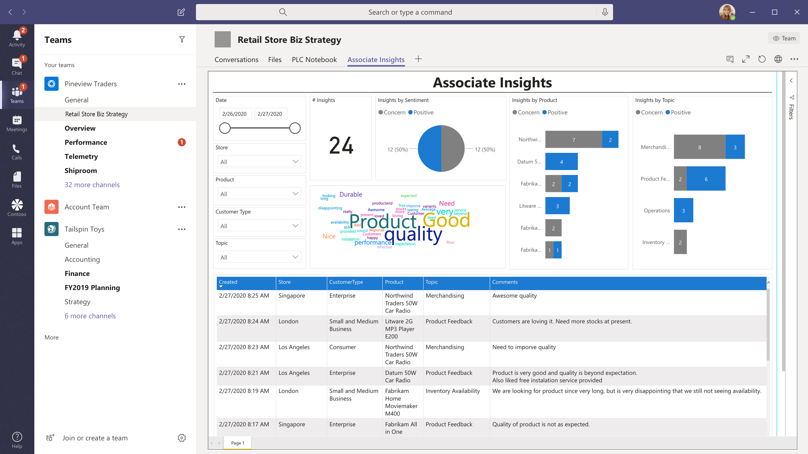
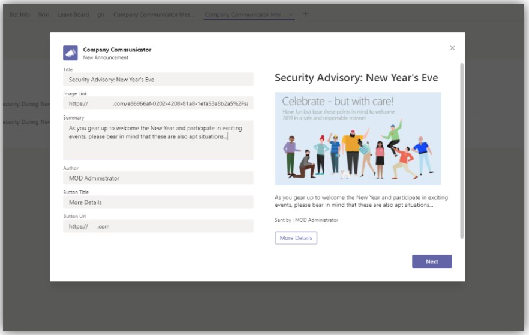
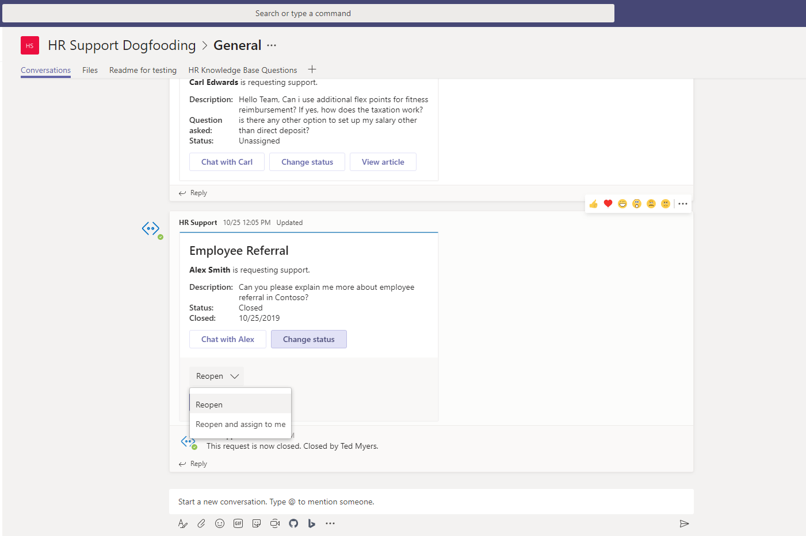
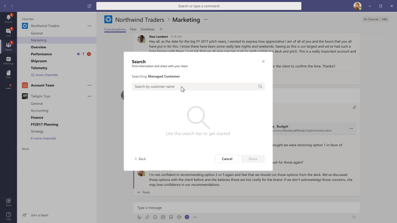

# Microsoft 团队的应用程序模板

应用程序模板是 Microsoft 团队的已准备好的应用程序，这些应用程序是社区驱动的开放源代码、开放源代码和在 GitHub 上可用的 Microsoft 团队。 每个都包含为您的组织部署和安装该应用程序的详细说明，提供可供安装并立即开始使用的现成应用程序。 完整的源代码也是可用的，因此您可以对其进行详细研究，也可以对代码进行更改，以满足您的特定需求。

**&#9734; 指示新发布的应用程序模板。**

### 主要好处

* **即插即用体验：** 所有应用程序模板都包含可让您在 Microsoft Azure 中托管所有必要服务的部署脚本。 部署应用程序不需要任何编码。
* **生产-就绪代码：** 应用程序模板符合建议的安全和基础结构最佳做法，并对其提交的所有社区更改进行检查，以确保继续符合标准。
* **可自定义和扩展：** 虽然所有应用程序模板都准备好部署，但我们提供了完整的代码库和部署脚本，以便您可以轻松地自定义或扩展它们以满足您的独特需求。
* **& 支持的详细文档：** 所有应用程序模板都附带了有关解决方案体系结构、部署和配置步骤的端到端文档。 存储库也将受到监视，因此，请通过在 GitHub 上提出问题来报告遇到的任何问题。

## 员工见解

关联 insights 是一个[Power Apps](/powerapps/maker/canvas-apps/embed-teams-app)模板，它使 firstline 工作人员能够直接捕获和提交客户意见、看法和感知。 Firstline 工作者通常是第一个公司代表，在一对一联系人中与客户接洽。 收集的数据可由业务团队共同共享和使用，例如，通过 Power BI "团队" 选项卡，可实现产品改进并增强客户体验。

[在 GitHub 上获取它](https://github.com/OfficeDev/microsoft-teams-apps-associateinsights)

:::row:::
  :::column span="2":::
      
:::column-end:::
:::row-end:::
:::row:::
:::column span="2":::
    
:::column-end:::
:::row-end:::

## 考勤

"出席" 应用是可在团队中固定的 "[电源应用](/powerapps/maker/canvas-apps/embed-teams-app)" 选项卡。 它旨在记录状态，通常是在学习和培训环境等设置中。 用户可以在过去的30天内标记或编辑出席情况，并查看整个组或单个与会者的汇总出勤报告。

[在 GitHub 上获取它](https://github.com/OfficeDev/microsoft-teams-apps-attendance)

## 会议室

会议室是[Microsoft 团队 bot](../bots/what-are-bots.md) ，可让用户快速查找和保留从当前时间起30（默认）、60或90分钟的会议室。 书籍-会议室的 bot 作用域到个人或1:1 对话。

[在 GitHub 上获取它](https://github.com/OfficeDev/microsoft-teams-apps-bookaroom)

## Celebrations

Celebrations 是一种团队应用，可帮助工作组成员庆祝他人的生日、周年纪念和其他定期事件。 它会记住所有团队成员的特殊情况，并在创建事件时在选择的所有团队中发送一封友好的消息，以使工作组成员在自己的日期中感到特别。

该应用程序为所有团队成员提供了一个简单的界面，以供个人添加和查看他们的事件，还允许用户选择共享事件的团队。

[在 GitHub 上获取它](https://github.com/OfficeDev/microsoft-teams-celebrations-app)

## Company Communicator

公司 Communicator 应用程序使公司团队能够创建和发送邮件，以供多个团队或大量员工通过聊天，使组织能够向员工进行协作。 将此模板用于多种方案，如新的计划通知、员工加入、新式学习和开发或组织范围的广播。

该应用程序为指定用户提供了用于创建、预览、协作和发送邮件的简单界面。

它提供了构建自定义的目标通信功能（如自定义遥测）对邮件进行了多少用户的确认或交互的基础。

[在 GitHub 上获取它](https://github.com/OfficeDev/microsoft-teams-company-communicator-app)

## 联系人组查找 &#9734;

联系人组查找应用程序为创建、访问和管理组织的联系人组（以前称为通讯组列表或通讯组）提供了一种便利且有用的方法。 用户可以快速查看和聊天组成员、查看成员状态以及创建与联系人组中所选成员的组聊天，这一切都在团队环境中。

[在 GitHub 上获取它](https://github.com/OfficeDev/microsoft-teams-app-contactgrouplookup)

:::row:::
:::column span="2":::
      
:::column-end:::
:::row-end:::
:::row:::
:::column span="2":::
    
:::column-end:::
:::row-end:::

## CrowdSourcer

CrowdSourcer 是一种[Microsoft 团队 bot](../bots/what-are-bots.md) ，可向团队查询与组成员协作的信息。 这是在帮助参与者积极参与并参与有趣和有用的信息资源的同时，回答常见问题的一种非常好的方法。

[在 Github 上获取它](https://github.com/OfficeDev/microsoft-teams-crowdsourcer-app)

## 自定义贴纸

自表达式是正常团队区域性的核心。 此应用程序模板是一种[消息扩展](~/messaging-extensions/what-are-messaging-extensions.md)，使用户能够在 Microsoft 团队中使用自定义不干胶标签和 gif。 此模板提供了简单的基于 web 的配置体验，其中任何具有配置访问权限的用户都可以上传他们希望最终用户拥有的 Gif/不干胶标签/图像，从而使整个团队能够使用您选择的任何一组不干胶标签。

此应用程序还可以跨团队轻松共享图像/Gif/不干胶标签，而无需像存储和共享机制那样访问 SharePoint 网站或单个通道。 例如，产品团队可以以编程方式轻松地将产品图像和 Gif 共享到社交媒体、市场营销和销售团队。 还可以通过触发新图像/Gif 时向特定团队/个人发出通知流来扩展此应用。

[在 GitHub 上获取它](https://github.com/OfficeDev/microsoft-teams-stickers-app)

## 专家查找程序

专家查找器是[Microsoft 团队的 bot](../bots/what-are-bots.md) ，它根据技能、兴趣和教育属性确定特定组织成员。 成员查找组织内与 Azure Active Directory 用户配置文件的关键字搜索相匹配的专家。

[在 GitHub 上获取它](https://github.com/OfficeDev/microsoft-teams-apps-expertfinder)

## 常见问题 +

对话 Q&bot 是一种简单的方法，可提供用户对常见问题的解答。 但是，大多数 bot 无法以有意义的方式与用户接洽，因为在 bot 发生故障时没有人在循环中。 FAQ bot 是一个友好的 Q，&在无法帮助的情况中将人体带到循环中的 bot。 如果某个问题包含在知识库中，则可以向该 bot 提供一个问题，并且机器人会做出响应。 如果不是，则机器人允许用户提交一个查询，然后将该查询发布到预先配置的专家团队中，这有助于通过在团队内部执行通知来提供支持。

> [!NOTE]
> 最新版本的**FAQ 加上**支持改进的 Q&解决方案，通过使专家团队能够完成以下操作：
>
> &#x2714; 使用邮件扩展名直接在知识库中添加新的 Q&。
>
> &#x2714; 编辑和删除 Q&由 bot 添加的对。
>
> &#x2714; 跟踪 Q&的修订历史记录。
>
> &#x2714; 配置包含其他详细信息的答案以显示为[自适应卡片](../task-modules-and-cards/cards/cards-reference.md#adaptive-card)。
>
[**在 GitHub 上获取它**](https://github.com/OfficeDev/microsoft-teams-apps-faqplusv2)

## 目标跟踪程序 &#9734;

目标跟踪器应用程序是组织的一个综合解决方案，可帮助您在 Microsoft 团队中实现目标、观察进度和确认成功。 该应用程序使用户能够在专业、个人和团队级别上设置、跟踪和更新目标。 团队成员还会收到及时提醒和状态更新，以保持重点并保持跟踪。

[在 GitHub 上获取它](https://github.com/OfficeDev/microsoft-teams-app-goaltracker)

:::row:::
  :::column span="2":::
      
:::column-end:::
:::row-end:::
:::row:::
:::column span="2":::
    
:::column-end:::
:::row-end:::

## 组活动

组活动是 Microsoft 团队应用程序，使团队所有者可以轻松地在 Microsoft 团队的上下文中快速创建活动组和管理协作工作流。 启用活动作者以创建活动，在组中随机分发工作组成员，以及在活动完成之前，可以选择让 bot 发送提醒。

[在 GitHub 上获取它](https://github.com/OfficeDev/microsoft-teams-apps-groupactivities)

:::row:::
  :::column span="2":::
      
:::column-end:::
:::row-end:::
:::row:::
:::column span="2":::
    
:::column-end:::
:::row-end:::

## HR 支持

HR 支持机器人是一个友好的 Q&一个 bot，它将支持专业人员/专家从循环中的 HR 团队中引入帮助。 如果某个问题包含在知识库中，则可以向该 bot 提供一个问题，并且机器人会做出响应。 如果不是，则机器人允许用户提交一个查询，然后将其发布到预先配置的专家团队中，这些专家将通过在团队内部对通知进行操作来提供支持。 此外，机器人通过在问题中搜索预配置的标记来建议指向建议的 HR 策略/问题的链接。 此外，还可以在关联的选项卡中找到这些磁贴作为快速参考。 HR 支持适用于轻型 QnA，并可在组织中启动新项目/计划时提供快速支持。

[在 GitHub 上获取它](https://github.com/OfficeDev/microsoft-teams-hrsupport-app)

## Icebreaker

Icebreaker 是一种[Microsoft 团队 bot](../bots/what-are-bots.md) ，可帮助您的团队更好地通过将两个随机团队成员与每周匹配来实现。 通过自动建议用于两个成员的空闲时间，机器人可简化日程安排。 加强个人连接并使用此应用构建一个紧密的 knit 社区。

除了鼓励整个团队中的个人连接，Icebreaker 应用还可以帮助您的组织内 cultivate 基于兴趣的社区。 例如，您可以将此应用用于 DevOps 兴趣组，以帮助在您的组织中分布的想法和最佳做法逐渐。

[在 GitHub 上获取它](https://github.com/OfficeDev/microsoft-teams-icebreaker-app)

## 奖励

激励是管理和跟踪 incentivized 员工参与指定活动（如培训和更改管理计划）的[电源应用程序](/powerapps/maker/canvas-apps/embed-teams-app)模板。 管理员使用应用程序建立指定的活动、分配点以完成和为奖励指定所需的资格点级别。 员工使用应用程序查看其积累的积分，并在达到资格、请求和声明 redeemable 奖励时实现。

[在 GitHub 上获取它](https://github.com/OfficeDev/microsoft-teams-apps-incentives)

## 事件报告 &#9734;

事件报告程序是[Microsoft 团队 bot](../bots/what-are-bots.md) ，可优化组织中事件的管理。 机器人可促进自动化的事件数据收集、自定义的事件报告、相关的利益干系人通知和端到端事件跟踪。

[在 GitHub 上获取它](https://github.com/OfficeDev/microsoft-teams-apps-incidentreport)

:::row:::
  :::column span="2":::
      
:::column-end:::
:::row-end:::
:::row:::
:::column span="2":::
    
:::column-end:::
:::row-end:::

## 开放徽章

开放徽章是 Microsoft 团队应用程序，它使个人能够在团队上下文中获得数字学习凭据标记，并在任何位置共享这些徽章。 使用第三方数字标记颁发机构中的功能（ [Badgr](https://badgr.org/)）会在收件人的 Badgr 配置文件中记录的徽章，并可用于构建和共享生命学习旅程的丰富图片。

[在 GitHub 上获取它](https://github.com/OfficeDev/microsoft-teams-apps-openbadges)

:::row:::
  :::column span="2":::
      
:::column-end:::
:::row-end:::
:::row:::
:::column span="2":::
    
:::column-end:::
:::row-end:::

## 快速响应

快速响应是 Microsoft 团队应用程序，它为有效回答用户的常见问题（Faq）提供了一个强健的解决方案。 应用程序将通过团队[消息传递扩展](../messaging-extensions/what-are-messaging-extensions.md)构建一个响应库，以获取交互式用户体验的响应库，而不是手动应答每个查询。

[在 GitHub 上获取它](https://github.com/OfficeDev/microsoft-teams-apps-quickresponses)

## 远程支持 &#9734;

远程支持是[Microsoft 团队的 bot](../bots/what-are-bots.md) ，它在整个组织和内部支持团队中提供了支持请求者之间的重点界面。  最终用户可以提交、编辑或撤消支持请求，并且支持团队可以在团队平台内响应、管理和更新所有请求。

[在 GitHub 上获取它](https://github.com/OfficeDev/microsoft-teams-apps-remotesupport)

:::row:::
  :::column span="2":::
      
:::column-end:::
:::row-end:::
:::row:::
:::column span="2":::
    
:::column-end:::
:::row-end:::

## 请求-a-团队 &#9734;

请求-a 团队是 Microsoft 团队应用，可优化企业组织的新团队创建。 当通过集成向导导向的请求表单、嵌入的审批流程、请求状态仪表板和自动化的团队版本来创建新的团队实例时，应用程序支持标准化和最佳做法。

[在 GitHub 上获取它](https://github.com/OfficeDev/microsoft-teams-apps-requestateam)

:::row:::
  :::column span="2":::
    
:::column-end:::
:::row-end:::
:::row:::
:::column span="2":::
    
:::column-end:::
:::row-end:::

## 频道 &#9734; 的 Scrums

频道的 Scrums 是一个 scrum 助理应用程序，它使用户能够在 Microsoft 团队内的频道中安排和运行 Scrums。 对于由来自不同地理位置和时区的成员组成的远程团队和团队而言，应用程序非常适合共享每日更新，并确保参与 scrum 独立式会议。

[在 GitHub 上获取它](https://github.com/OfficeDev/microsoft-teams-apps-scrumsforchannels)

> [!NOTE]
> 若要在群聊中开展 scrum 会议，请参阅我们[的 Scrums For Group chat](#scrums-for-group-chat-)应用程序模板。

:::row:::
  :::column span="2":::
    
:::column-end:::
:::row-end:::
:::row:::
:::column span="2":::
    
:::column-end:::
:::row-end:::

## Scrums &#9734; 的组聊天

> [!NOTE]
> Scrums 状态应用程序模板已更新，现已 Scrums 进行分组聊天。

分组聊天的 Scrums 是支持 scrum 的 scrum 助理，它允许组聊天成员运行异步的独立式会议，并轻松共享每日更新。 它允许群的所有成员参与 scrum，并查看运行 scrum 中的其他人所做的更新。

[在 GitHub 上获取它](https://github.com/OfficeDev/microsoft-teams-apps-scrumsforgroupchat)

## 立即共享 &#9734;

"立即共享" 应用通过使您的用户能够轻松地在团队环境中共享内容来促进同事之间的信息交换。 用户可让应用与团队成员共享感兴趣的项目、发现新的共享内容、设置首选项以及书签收藏夹以供以后阅读。

[在 GitHub 上获取它](https://github.com/OfficeDev/microsoft-teams-apps-sharenow)

## SharePoint 列表搜索

Microsoft 团队中的协作通常会引用 SharePoint 列表中项目中包含的信息。 只需粘贴指向相关项目的链接，即可强制每个人都切换上下文以离开对话，查找所需的信息，然后返回到团队以继续进行对话。 随着对话的持续不断，人们通常需要多次切换回参考项目，以验证新注释并刷新项目中包含的信息的记忆。 此上下文切换为平滑协作创建了一个障碍，并且是通过裂纹的方法实现的食谱。

为帮助缓解这一困难，我们很乐意向你推荐列表搜索应用程序模板。 数百万个用户使用 SharePoint 来为组织中的一些核心工作流加电。 但是，在列表方面进行协作可能会非常单调。 通过在 Microsoft 团队中使用列表搜索应用程序模板，用户可以直接在聊天对话中插入 SharePoint 列表项中的信息，以缓解在简单地将链接插入聊天时导致的上下文切换。 该信息作为一种易于阅读的自动格式化卡片插入，可帮助您的用户保持对话中的参与。

[在 GitHub 上获取它](https://github.com/OfficeDev/microsoft-teams-list-search-app)

## 访问者管理 &#9734;

通过访问者管理应用，你的组织和员工可以直接从 Microsoft 团队轻松高效地管理现场访问者进程。 该应用程序使员工能够创建访问者请求，通过 "访问者" 仪表板集中跟踪请求状态，并在访问者到达时收到实时通知。

[在 GitHub 上获取它](https://github.com/OfficeDev/microsoft-teams-app-visitormanagement)

:::row:::
  :::column span="2":::
    
:::column-end:::
:::row-end:::
:::row:::
:::column span="2":::
    
:::column-end:::
:::row-end:::

## 工作场所奖项 &#9734;

Workplace 奖项是一个团队应用程序模板，它提供了积极的框架来促进认可，并鼓励新式工作场所的员工感谢文化。 此应用程序使您能够设置和管理员工奖励和表彰（R&R）计划，在该计划中，员工可以轻松地提名和签署同事，而您的 R&R 主持人可以查看提交的 nominations、授予奖项并通知收件人。

[在 GitHub 上获取它](https://github.com/OfficeDev/microsoft-teams-apps-workplaceawards)

:::row:::
  :::column span="2":::
    
:::column-end:::
:::row-end:::
:::row:::
:::column span="2":::
    
:::column-end:::
:::row-end:::

您想要查看的应用程序模板有什么想法？ [请告知我们](https://forms.office.com/Pages/ResponsePage.aspx?id=v4j5cvGGr0GRqy180BHbR2_7qFm_lcZAr4eqEhnLsZ9UMVZGT1lCT0FXUDdZMUM0RkpBS1BESTAwWC4u)。
