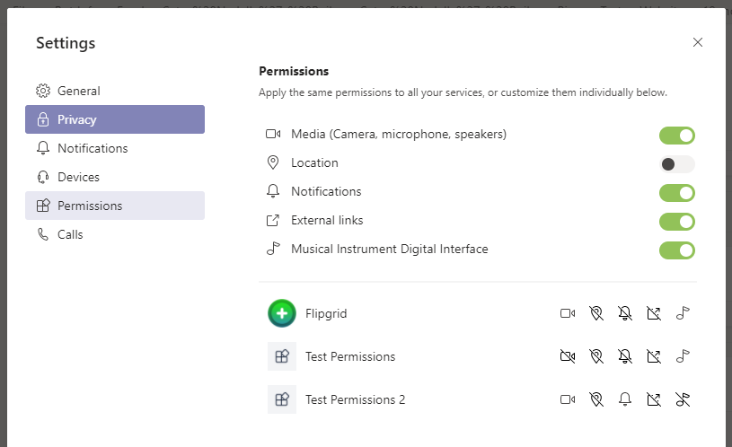

# <a name="request-device-permissions-for-your-microsoft-teams-tab"></a><span data-ttu-id="10dc5-104">为 Microsoft "团队" 选项卡请求设备权限</span><span class="sxs-lookup"><span data-stu-id="10dc5-104">Request device permissions for your Microsoft Teams tab</span></span>

<span data-ttu-id="10dc5-105">您可能希望使用需要访问本机设备功能的功能来丰富您的选项卡，如下所示：</span><span class="sxs-lookup"><span data-stu-id="10dc5-105">You might want to enrich your tab with features that require access native device functionality like:</span></span>

> [!div class="checklist"]
>
> * <span data-ttu-id="10dc5-106">拍照</span><span class="sxs-lookup"><span data-stu-id="10dc5-106">Camera</span></span>
> * <span data-ttu-id="10dc5-107">着</span><span class="sxs-lookup"><span data-stu-id="10dc5-107">Microphone</span></span>
> * <span data-ttu-id="10dc5-108">位置</span><span class="sxs-lookup"><span data-stu-id="10dc5-108">Location</span></span>
> * <span data-ttu-id="10dc5-109">通知</span><span class="sxs-lookup"><span data-stu-id="10dc5-109">Notifications</span></span>

> [!IMPORTANT]
>
> * <span data-ttu-id="10dc5-110">目前，工作组移动客户端仅支持 `camera` 和 `location` 通过本机设备功能，并可在包括选项卡在内的所有应用程序结构中使用。</span><span class="sxs-lookup"><span data-stu-id="10dc5-110">Currently, Teams mobile client only supports `camera` and `location`  through native device capabilities and is available on all app constructs including tabs.</span></span> </br>
> * <span data-ttu-id="10dc5-111">对 `camera` 图像捕获的支持由[**captureImage API**](/javascript/api/@microsoft/teams-js/microsoftteams?view=msteams-client-js-latest#captureimage--error--sdkerror--files--file-------void-)启用。</span><span class="sxs-lookup"><span data-stu-id="10dc5-111">Support for `camera` image capture is enabled by the [**captureImage API**](/javascript/api/@microsoft/teams-js/microsoftteams?view=msteams-client-js-latest#captureimage--error--sdkerror--files--file-------void-).</span></span>
> * <span data-ttu-id="10dc5-112">目前，所有桌面客户端都不完全支持[**地理位置 API**](../../resources/schema/manifest-schema.md#devicepermissions) 。</span><span class="sxs-lookup"><span data-stu-id="10dc5-112">The [**geolocation API**](../../resources/schema/manifest-schema.md#devicepermissions) is currently not fully supported on all desktop clients.</span></span>

## <a name="device-permissions"></a><span data-ttu-id="10dc5-113">设备权限</span><span class="sxs-lookup"><span data-stu-id="10dc5-113">Device permissions</span></span>

<span data-ttu-id="10dc5-114">通过访问用户的设备权限，您可以生成更丰富的体验，例如：</span><span class="sxs-lookup"><span data-stu-id="10dc5-114">Accessing a user’s device permissions allows you to build much richer experiences, for example:</span></span>

* <span data-ttu-id="10dc5-115">记录和共享简短视频</span><span class="sxs-lookup"><span data-stu-id="10dc5-115">Record and share short videos</span></span>
* <span data-ttu-id="10dc5-116">录制简短的音频备忘录并在以后保存它们</span><span class="sxs-lookup"><span data-stu-id="10dc5-116">Record short audio memos and save them for later</span></span>
* <span data-ttu-id="10dc5-117">使用用户位置信息显示相关信息</span><span class="sxs-lookup"><span data-stu-id="10dc5-117">Use user location information to display relevant information</span></span>

<span data-ttu-id="10dc5-118">[！重要说明] 虽然在大多数新式 web 浏览器中访问这些功能是标准的，但你需要让团队知道你要使用哪些功能来更新你的应用程序清单。</span><span class="sxs-lookup"><span data-stu-id="10dc5-118">While access to these features are standard in most modern web browsers, you need to let Teams know which features you’d like to use by updating your app manifest.</span></span> <span data-ttu-id="10dc5-119">这样，您就可以像在浏览器中一样请求权限，而在团队桌面客户端上运行应用程序。</span><span class="sxs-lookup"><span data-stu-id="10dc5-119">This will allow you to ask for permissions, the same way you would in a browser, while your app is running on the Teams desktop client.</span></span>

## <a name="manage-permissions"></a><span data-ttu-id="10dc5-120">管理权限</span><span class="sxs-lookup"><span data-stu-id="10dc5-120">Manage permissions</span></span>

# <a name="desktop"></a>[<span data-ttu-id="10dc5-121">桌面</span><span class="sxs-lookup"><span data-stu-id="10dc5-121">Desktop</span></span>](#tab/desktop)

1. <span data-ttu-id="10dc5-122">打开团队。</span><span class="sxs-lookup"><span data-stu-id="10dc5-122">Open Teams.</span></span>
1. <span data-ttu-id="10dc5-123">在窗口的右上角，选择您的配置文件图标。</span><span class="sxs-lookup"><span data-stu-id="10dc5-123">In the upper right corner of the window, select your profile icon.</span></span>
1. <span data-ttu-id="10dc5-124">从下拉菜单中选择 "**设置**  ->  **权限**"。</span><span class="sxs-lookup"><span data-stu-id="10dc5-124">Select **Settings** -> **Permissions** from the drop-down menu.</span></span>
1. <span data-ttu-id="10dc5-125">选择所需的设置。</span><span class="sxs-lookup"><span data-stu-id="10dc5-125">Choose your desired settings.</span></span>



# <a name="mobile"></a>[<span data-ttu-id="10dc5-127">移动</span><span class="sxs-lookup"><span data-stu-id="10dc5-127">Mobile</span></span>](#tab/mobile)

1. <span data-ttu-id="10dc5-128">打开团队。</span><span class="sxs-lookup"><span data-stu-id="10dc5-128">Open Teams.</span></span>
1. <span data-ttu-id="10dc5-129">在屏幕左上角，选择 "&#9776;" 菜单图标。</span><span class="sxs-lookup"><span data-stu-id="10dc5-129">In the upper left corner of the screen, select the &#9776; menu icon.</span></span>
1. <span data-ttu-id="10dc5-130">选择 "**设置**  ->  **设备**"。</span><span class="sxs-lookup"><span data-stu-id="10dc5-130">Select **Settings** -> **Devices**.</span></span>
1. <span data-ttu-id="10dc5-131">选择所需的设置。</span><span class="sxs-lookup"><span data-stu-id="10dc5-131">Choose your desired settings.</span></span>


---

## <a name="properties"></a><span data-ttu-id="10dc5-133">属性</span><span class="sxs-lookup"><span data-stu-id="10dc5-133">Properties</span></span>

<span data-ttu-id="10dc5-134">`manifest.json`通过添加 `devicePermissions` 和指定要在应用程序中使用的五个属性中的哪一个来更新应用程序：</span><span class="sxs-lookup"><span data-stu-id="10dc5-134">Update your app's `manifest.json` by adding `devicePermissions` and specifying which of the five properties you’d like to use in your application:</span></span>

``` json
"devicePermissions": [
    "media",
    "geolocation",
    "notifications",
    "midi",
    "openExternal"
],
```
> [!Note]
>
> <span data-ttu-id="10dc5-135">媒体也可用于移动设备中的相机权限。</span><span class="sxs-lookup"><span data-stu-id="10dc5-135">Media is also used for camera permissions in mobile.</span></span>

<span data-ttu-id="10dc5-136">每个属性都允许你提示用户提出同意</span><span class="sxs-lookup"><span data-stu-id="10dc5-136">Each property will allow you to prompt the user to ask for their consent</span></span>

| <span data-ttu-id="10dc5-137">属性</span><span class="sxs-lookup"><span data-stu-id="10dc5-137">Property</span></span>      | <span data-ttu-id="10dc5-138">说明</span><span class="sxs-lookup"><span data-stu-id="10dc5-138">Description</span></span>   |
| --- | --- |
| <span data-ttu-id="10dc5-139">media</span><span class="sxs-lookup"><span data-stu-id="10dc5-139">media</span></span>         | <span data-ttu-id="10dc5-140">使用摄像头、麦克风和扬声器的权限</span><span class="sxs-lookup"><span data-stu-id="10dc5-140">permission to use the camera, microphone and speakers</span></span> |
| <span data-ttu-id="10dc5-141">地理位置</span><span class="sxs-lookup"><span data-stu-id="10dc5-141">geolocation</span></span>   | <span data-ttu-id="10dc5-142">返回用户位置的权限</span><span class="sxs-lookup"><span data-stu-id="10dc5-142">permission to return the user's location</span></span>      |
| <span data-ttu-id="10dc5-143">通知</span><span class="sxs-lookup"><span data-stu-id="10dc5-143">notifications</span></span> | <span data-ttu-id="10dc5-144">发送用户通知的权限</span><span class="sxs-lookup"><span data-stu-id="10dc5-144">permission to send the user notifications</span></span>      |
| <span data-ttu-id="10dc5-145">midi</span><span class="sxs-lookup"><span data-stu-id="10dc5-145">midi</span></span>          | <span data-ttu-id="10dc5-146">从数字音乐仪器发送和接收 midi 信息的权限</span><span class="sxs-lookup"><span data-stu-id="10dc5-146">permission to send and receive midi information from a digital musical instrument</span></span>   |
| <span data-ttu-id="10dc5-147">openExternal</span><span class="sxs-lookup"><span data-stu-id="10dc5-147">openExternal</span></span>  | <span data-ttu-id="10dc5-148">在外部应用程序中打开链接的权限</span><span class="sxs-lookup"><span data-stu-id="10dc5-148">permission to open links in external applications</span></span>  |

## <a name="checking-permissions-from-your-tab"></a><span data-ttu-id="10dc5-149">从选项卡检查权限</span><span class="sxs-lookup"><span data-stu-id="10dc5-149">Checking permissions from your tab</span></span>

<span data-ttu-id="10dc5-150">添加 `devicePermissions` 到应用程序清单后，可以使用 HTML5 "权限" API 检查权限，而不会导致出现提示。</span><span class="sxs-lookup"><span data-stu-id="10dc5-150">Once you’ve added `devicePermissions` to your app manifest, you can check permissions using the HTML5 “permissions” API without causing a prompt.</span></span>

``` Javascript
// Different query options:
navigator.permissions.query({ name: 'camera' });
navigator.permissions.query({ name: 'microphone' });
navigator.permissions.query({ name: 'geolocation' });
navigator.permissions.query({ name: 'notifications' });
navigator.permissions.query({ name: 'midi', sysex: true });

// Example:
navigator.permissions.query({name:'geolocation'}).then(function(result) {
  if (result.state == 'granted') {
    // Access granted
  } else if (result.state == 'prompt') {
    // Access has not been granted
  }
});
```

## <a name="prompting-the-user"></a><span data-ttu-id="10dc5-151">提示用户</span><span class="sxs-lookup"><span data-stu-id="10dc5-151">Prompting the user</span></span>

<span data-ttu-id="10dc5-152">若要显示提示以获取访问设备权限的许可，您需要利用相应的 HTML5 或团队 API。</span><span class="sxs-lookup"><span data-stu-id="10dc5-152">In order to show a prompt to get consent to access device permissions you need to leverage the appropriate HTML5 or Teams API.</span></span> <span data-ttu-id="10dc5-153">例如，为了提示用户访问其相机，您需要呼叫`getCurrentPosition`</span><span class="sxs-lookup"><span data-stu-id="10dc5-153">For example, in order to prompt the user to access their camera you need to call `getCurrentPosition`</span></span>

```Javascript
navigator.geolocation.getCurrentPosition(function (position) { /*... */ });
```

<span data-ttu-id="10dc5-154">若要在桌面或 web 上使用摄像头，团队会在您调用 getUserMedia 时显示权限提示。</span><span class="sxs-lookup"><span data-stu-id="10dc5-154">To use camera on desktop or web, Teams will show a permission prompt when you call getUserMedia</span></span>

```Javascript
navigator.mediaDevices.getUserMedia({ audio: true, video: true });
```

<span data-ttu-id="10dc5-155">若要在移动时捕获图像，团队移动将在调用 captureImage 时请求权限（）</span><span class="sxs-lookup"><span data-stu-id="10dc5-155">To capture image on mobile, Teams mobile will ask for permission when called captureImage()</span></span>

```Typescript
function captureImage(callback: (error: SdkError, files: File[]) => void)
```

<span data-ttu-id="10dc5-156">调用时，通知将提示用户`requestPermission`</span><span class="sxs-lookup"><span data-stu-id="10dc5-156">Notifications will prompt the user when you call `requestPermission`</span></span>

```Javascript
Notification.requestPermission(function(result) { /* ... */ });
```


## <a name="permission-behavior-across-login-sessions"></a><span data-ttu-id="10dc5-158">跨登录会话的权限行为</span><span class="sxs-lookup"><span data-stu-id="10dc5-158">Permission behavior across login sessions</span></span>

<span data-ttu-id="10dc5-159">本机设备权限是按每个登录会话存储的。</span><span class="sxs-lookup"><span data-stu-id="10dc5-159">Native device permissions are stored per login session.</span></span> <span data-ttu-id="10dc5-160">这意味着，如果您登录到团队的另一个实例（例如，在另一台计算机上），您的设备权限将不可用。</span><span class="sxs-lookup"><span data-stu-id="10dc5-160">This means that if you log into another instance of Teams (ex: on another computer), your device permissions from your previous sessions will not be available.</span></span> <span data-ttu-id="10dc5-161">相反，你将需要重新同意新登录会话的设备权限。</span><span class="sxs-lookup"><span data-stu-id="10dc5-161">Instead, you will need to re-consent to device permissions for the new login session.</span></span> <span data-ttu-id="10dc5-162">这也意味着，如果您注销团队（或团队内部的交换机租户），则将删除该先前登录会话的设备权限。</span><span class="sxs-lookup"><span data-stu-id="10dc5-162">This also means, if you log out of Teams (or switch tenants inside of Teams), your device permissions will be deleted for that previous login session.</span></span> <span data-ttu-id="10dc5-163">在开发本机设备权限时，请记住这一点：您同意的本机功能仅适用于您的_当前_登录会话。</span><span class="sxs-lookup"><span data-stu-id="10dc5-163">Please keep this in mind when developing native device permissions: the native capabilities you consent to are only for your _current_ login session.</span></span>
